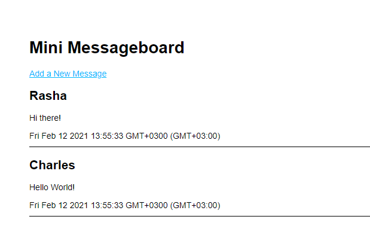

# node-messageboard

It is a simple board where you can see messages and add a new message to the board

## Used Technologies

- Express-generator
- Nodejs
- PUG as a template language

## Output
  
 
## How to Use

1.  clone the repository.
2.  run npm install
3.  run npm start
4.  check the output at [localhost](localhost:3000)
